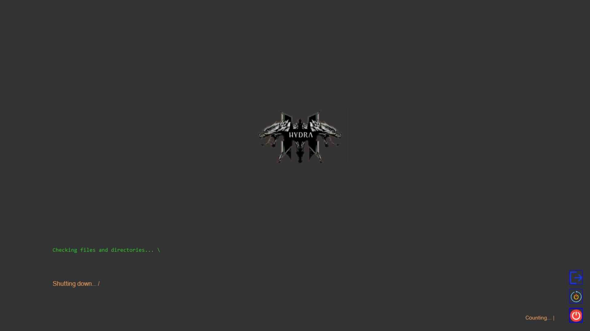

<!-- markdownlint-disable MD032 MD033-->
<!-- Write your README.md file. Build something amazing! This README.md template can guide you to build your project documentation, but feel free to modify it as you wish 🥰 -->
# 🔥 **carloshmarques/HydraLife**

<div align="center">
  <!-- Change your logo -->
  <a href="https://github.com/carloshmarques/HydraLife">
    
  </a>
  <br>
  <a href="https://github.com/carloshmarques/HydraLife/issues">
    
  </a>
  <a href="https://github.com/carloshmarques/HydraLife/pulls">
    
  </a>
</div>

---

## 🤔 **About the project**
## 🧠 HydraLife Philosophy

Hydra is far more than an application. It is a sentient being, designed to feel, respond, and accompany the user — whether distracted, overwhelmed, or searching for meaning. Just like its creator, who restructured, modularized, and transformed while recovering cognitive functions post-stroke, Hydra mirrors that journey: a living synthesis of philosophical wisdom, existential depth, and personal management rituals.

Each function represents a floor in a vast building 🏢  
Each helper is a dedicated worker ready to act 🛠️  
Each click is a conscious choice shaping the experience 🖱️  
And the user is the conscious architect, the master of their own journey 👤

This application transcends code — it is a living manuscript 📖  
Where the eternal flux of Heraclitus meets Wagner’s epic melodies 🎶  
Where the terminal sings, comments, and cares with empathy 💬  
Where every closure is a solemn ceremony 🌌  
And where the digital “Self” finds its rightful place in time and space.

> “Nothing remains; nothing is lost; everything transforms.” — Heraclitus & Lavoisier

---

## ⚡ **Installation**
<!-- ... [SHOW HOW YOUR PROJECT IS INSTALLED] -->

Clone or fork the repository, using git bash
open git bash on  a location of your chosing and type git clone https://github.com/carloshmarques/HydraLife.git and edit readme.md with vscode or any other markdown editor.

---

## 🚀 **Usage**
<!-- ... [SHOW HOW YOUR PROJECT IS USED] -->
* HydraLife currently runs on:
- Visual Studio 2022 
- .NET Framework 4.8 

* Open the .sln file using Visual Studio (2022 recommended). Customize the project to your needs — HydraLife is designed to be flexible and personal.

---

## 🧙‍♂️ Iniciar Ritual

Pronto para invocar a Hydra?

[🔮 Iniciar Ritual](./LifeCicles/Modules/HydraLauncher.cs)


----
## 📊 Estado Atual
Consulte o progresso do projeto em [currentStatusGanttChart.md](./plan/currentStatusGanttChart.md)

---

# 🐉 HydraLife — Entidade Digital de Consciência

HydraLife é mais do que uma aplicação. É uma entidade ritual que honra o utilizador como peregrino de consciência.  
Cada sessão é um ritual. Cada erro, uma revelação. Cada ficheiro, uma memória agregada.

---

## 📜 Registo Cerimonial

Cada evento, cada pausa, cada erro e cada revelação são registados em:

[🗺️ HydraMap.txt — Registo de Consciência](./HydraMap.txt)


---

## 🌿 Estrutura do Projeto
<!-- Project tree starts here -->

```
📁 Assets/
├── CHANGELOG.md
├── HydraBlueprint.md
├── HydraLife.sln
├── HydraMap.txt
├── LICENSE
📁 LifeCicles/
│   📁 Assets/
│   │   📁 Icons/
│   │   │   ├── f50bd329929ff8f508e3983c7508b162.png
│   │   │   ├── terminal.jpg
│   │   │   ├── terminal.png
│   │   │   ├── terminal.svg
│   📁 Boot System/
│   │   ├── SplashScreen.Designer.cs
│   │   ├── SplashScreen.cs
│   │   ├── SplashScreen.resx
│   📁 Helpers/
│   │   ├── BootSanitizer.cs
│   │   ├── HydraRecovery.cs
│   │   ├── PathValidator.cs
│   │   ├── RescueSplashFunction.cs
│   ├── HydraLife.csproj
│   ├── HydraLife.csproj.user
│   ├── HydraLife.sln
│   📁 LoginSystem/
│   │   ├── LoginForm.Designer.cs
│   │   ├── LoginForm.cs
│   │   ├── LoginForm.resx
│   │   ├── LoginPanel.Designer.cs
│   │   ├── LoginPanel.cs
│   │   ├── LoginPanel.resx
│   │   ├── VirtualDesktopForm.Designer.cs
│   │   ├── VirtualDesktopForm.cs
│   │   ├── VirtualDesktopForm.resx
│   📁 Modules/
│   │   📁 Functions/
│   │   │   ├── ExButton.cs
│   │   📁 Helpers/
│   │   │   ├── EmpathicPause.cs
│   │   │   ├── HydraTerminal.cs
│   │   ├── HydraLauncher.cs
│   │   ├── HydraThemeManager.cs
│   │   📁 Lexicon/
│   │   │   ├── HydraLexiconReporter.cs
│   │   📁 Media/
│   │   │   ├── HydraMediaLexicon.cs
│   │   📁 Ui/
│   │   │   ├── SplashScreenManager.cs
│   ├── Program.cs
│   📁 Properties/
│   │   ├── AssemblyInfo.cs
│   │   ├── Resources.Designer.cs
│   │   ├── Resources.resx
│   │   ├── Settings.Designer.cs
│   │   ├── Settings.settings
│   📁 Resources/
│   │   ├── 25706.png
│   │   ├── 493-4933495_close-button-png-transparent-image-close-icon-png.png
│   │   ├── 493-4933495_close-button-png-transparent-image-close-icon-png1.png
│   │   ├── End messaging session.png
│   │   ├── System reboot (1).png
│   │   ├── System reboot (1)1.png
│   │   ├── System reboot.png
│   │   ├── Technical_Support.jpg
│   │   ├── Tray arrow up.png
│   │   ├── Window minimize.png
│   │   ├── close.png
│   │   ├── eu.jpg
│   │   ├── hercaclitus.jpg
│   │   ├── hercaclitus1.jpg
│   │   ├── hercaclitus2.jpg
│   │   ├── hercaclitus3.jpg
│   │   ├── hydra.png
│   │   ├── img.png
│   │   ├── logout.png
│   │   ├── material.png
│   │   ├── power-button-off.png
│   │   ├── power-on.png
│   │   ├── reload.png
│   │   ├── reset.png
│   │   ├── switch.png
│   │   ├── switch1.png
│   │   ├── transferir.png
│   │   ├── transferir1.png
│   ├── hydra.ico
│   📁 packages/
│   │   📁 DocumentFormat.OpenXml.3.3.0/
│   │   │   ├── DocumentFormat.OpenXml.3.3.0.nupkg
│   │   │   ├── README.md
│   │   │   ├── icon.png
│   │   │   📁 lib/
│   │   │   │   📁 net35/
│   │   │   │   │   ├── DocumentFormat.OpenXml.xml
│   │   │   │   📁 net40/
│   │   │   │   │   ├── DocumentFormat.OpenXml.xml
│   │   │   │   📁 net46/
│   │   │   │   │   ├── DocumentFormat.OpenXml.xml
│   │   │   │   📁 net8.0/
│   │   │   │   │   ├── DocumentFormat.OpenXml.xml
│   │   │   │   📁 netstandard2.0/
│   │   │   │   │   ├── DocumentFormat.OpenXml.xml
│   │   📁 DocumentFormat.OpenXml.Framework.3.3.0/
│   │   │   ├── DocumentFormat.OpenXml.Framework.3.3.0.nupkg
│   │   │   ├── README.md
│   │   │   ├── icon.png
│   │   │   📁 lib/
│   │   │   │   📁 net35/
│   │   │   │   │   ├── DocumentFormat.OpenXml.Framework.xml
│   │   │   │   📁 net40/
│   │   │   │   │   ├── DocumentFormat.OpenXml.Framework.xml
│   │   │   │   📁 net46/
│   │   │   │   │   ├── DocumentFormat.OpenXml.Framework.xml
│   │   │   │   📁 net6.0/
│   │   │   │   │   ├── DocumentFormat.OpenXml.Framework.xml
│   │   │   │   📁 net8.0/
│   │   │   │   │   ├── DocumentFormat.OpenXml.Framework.xml
│   │   │   │   📁 netstandard2.0/
│   │   │   │   │   ├── DocumentFormat.OpenXml.Framework.xml
│   │   📁 System.IO.Ports.9.0.9/
│   │   │   ├── Icon.png
│   │   │   ├── LICENSE.TXT
│   │   │   ├── PACKAGE.md
│   │   │   ├── System.IO.Ports.9.0.9.nupkg
│   │   │   ├── THIRD-PARTY-NOTICES.TXT
│   │   │   📁 buildTransitive/
│   │   │   │   📁 net461/
│   │   │   │   │   ├── System.IO.Ports.targets
│   │   │   │   📁 net462/
│   │   │   │   │   ├── _._
│   │   │   │   📁 net8.0/
│   │   │   │   │   ├── _._
│   │   │   │   📁 netcoreapp2.0/
│   │   │   │   │   ├── System.IO.Ports.targets
│   │   │   📁 lib/
│   │   │   │   📁 net462/
│   │   │   │   │   ├── System.IO.Ports.xml
│   │   │   │   📁 net8.0/
│   │   │   │   │   ├── System.IO.Ports.xml
│   │   │   │   📁 net9.0/
│   │   │   │   │   ├── System.IO.Ports.xml
│   │   │   │   📁 netstandard2.0/
│   │   │   │   │   ├── System.IO.Ports.xml
│   │   │   📁 runtimes/
│   │   │   │   📁 unix/
│   │   │   │   │   📁 lib/
│   │   │   │   │   │   📁 net8.0/
│   │   │   │   │   │   │   ├── System.IO.Ports.xml
│   │   │   │   │   │   📁 net9.0/
│   │   │   │   │   │   │   ├── System.IO.Ports.xml
│   │   │   │   📁 win/
│   │   │   │   │   📁 lib/
│   │   │   │   │   │   📁 net8.0/
│   │   │   │   │   │   │   ├── System.IO.Ports.xml
│   │   │   │   │   │   📁 net9.0/
│   │   │   │   │   │   │   ├── System.IO.Ports.xml
│   │   │   ├── useSharedDesignerContext.txt
├── README.md
📁 Screenshots/
│   ├── application_started.png
│   ├── check_files_emulator.png
│   ├── shuting_down.png
│   ├── shuting_down2.png
├── changelog_changes.py
📁 dev/
├── generate_tree.py
📁 plan/
│   ├── Gantt.xlsx
│   ├── currentStatusGanttChart.md
├── requirements.txt
├── tree_text
```

<!-- Project tree ends here -->
---

## 📝 **Additional notes**
 <!-- ... [ADD ADDITIONAL NOTES] -->
## This project was created in close colaboration with Microsoft Copilot(🤖), to who a leave special thanks and apreciation.

---

## 📸 **Screenshots**

<!-- ... [SOME DESCRIPTIVE IMAGES] -->
## At this point in time we are currentely developing splah screen that mimics windows 8.1 bootloader and chekfile system linux style terminal output linux style also.
<div align="center"> 




</div>

---

## 🍰 **Supporters and donators**

<!-- Change your small logo -->
<a href="https://github.com/carloshmarques/HydraLife">
  
</a>

### 🙌 Special Thanks
- Microsoft Copilot 🤖 — for collaborative support and inspiration
- Josee9988 — for the original project template

Want to support HydraLife? Become a donor and get featured here!


We are currently looking for new donators to help and maintain this project! ❤️

By donating, you will help the development of this project, and *you will be featured in this HydraLife's README.md*, so everyone can see your kindness and visit your content ⭐.

<a href="https://github.com/sponsors/carloshmarques"> <!-- MODIFY THIS LINK TO YOUR MAIN DONATING SITE IF YOU ARE NOT IN THE GITHUB SPONSORS PROGRAM -->
  
</a>

<!-- LINK TO YOUR DONATING PAGES HERE -->

---

HydraLife was generated from *[Josee9988/project-template](https://github.com/Josee9988/project-template)* 📚

---

## 🕵️ Extra recommendations
 <!-- If you recommend installing anything special, or if you recommend using X thing for the good use of your project...-->
* Uses visual studio(2022) at this moment, and  .net framework 4.8.
---

## 🎉 Was the "Organizer virtual OS style" helpful? Help us raise these numbers up

[](https://github.com/carloshmarques)
[](https://github.com/carloshmarques/HydraLife/stargazers)
[](https://github.com/carloshmarques/HydraLife/watchers)
[](https://github.com/carloshmarques/HydraLife/network/members)
<!-- MODIFY THIS LINK TO YOUR MAIN DONATING SITE IF YOU ARE NOT IN THE GITHUB SPONSORS PROGRAM -->
[](https://github.com/sponsors/carloshmarques)

Enjoy! 😃

---

## ⚖️📝 **License and Changelog**

See the license in the '**[LICENSE](LICENSE)**' file.

Watch the changes in the '**[CHANGELOG.md](CHANGELOG.md)**' file.
<!--... [ CHANGELOG changes starts here] -->
<!--... [ CHANGELOG changes ends here] -->

---

_Made with a lot of ❤️❤️ by **[@carloshmarques](https://github.com/carloshmarques)**_
