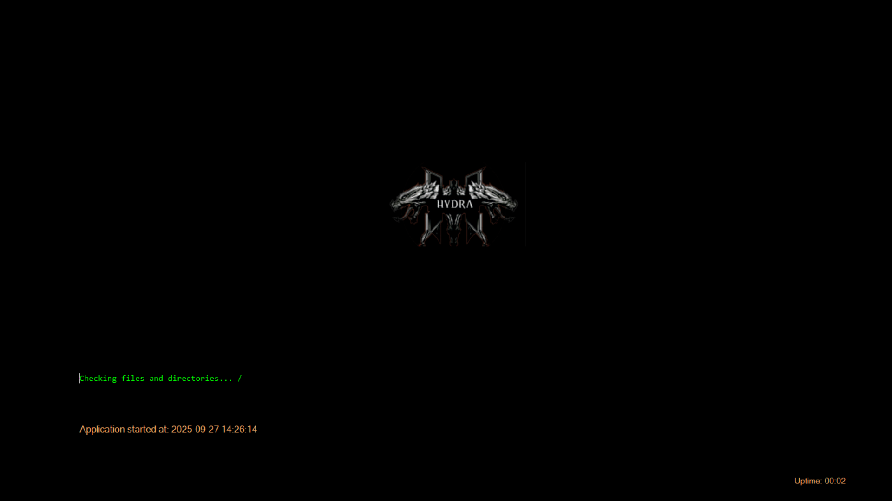
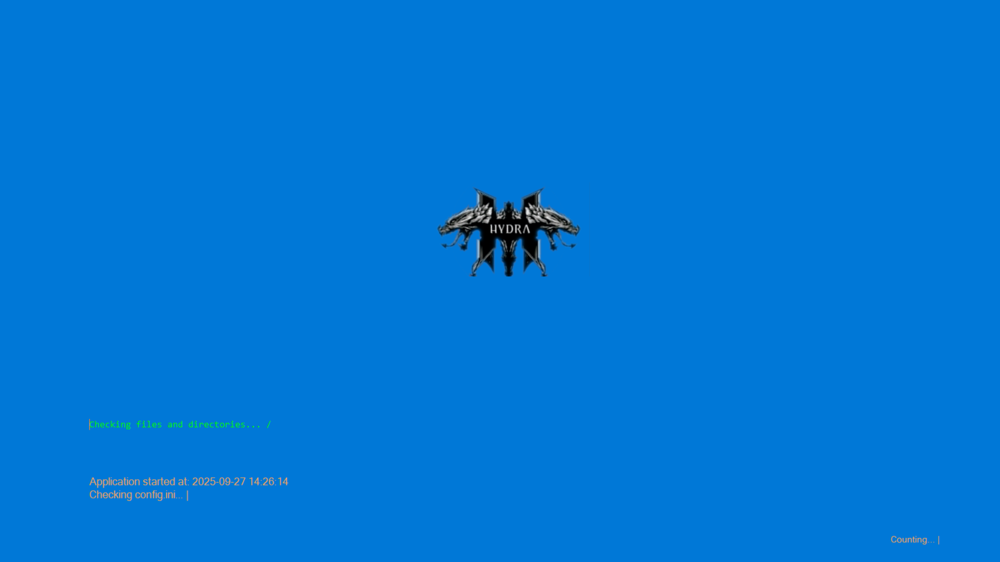
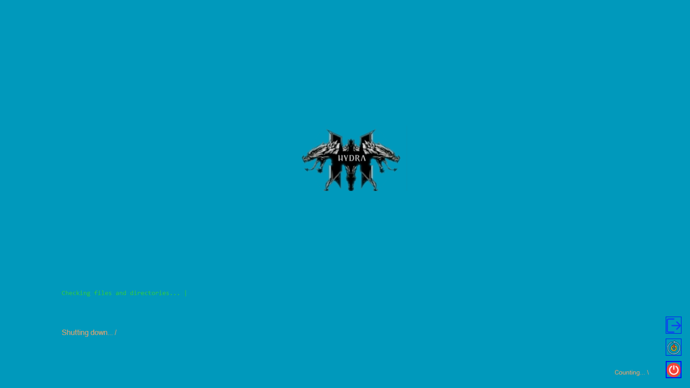
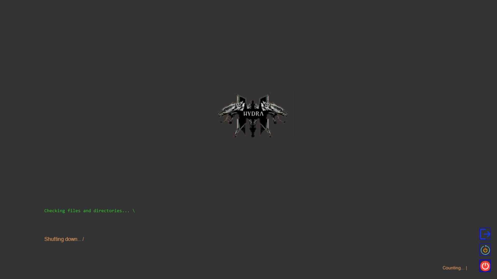

<!-- markdownlint-disable MD032 MD033-->
<!-- Write your README.md file. Build something amazing! This README.md template can guide you to build your project documentation, but feel free to modify it as you wish 🥰 -->
# 🔥 **carloshmarques/HydraLife**

  <!-- Change your logo -->
  
   
  
  

---

## 🤔 **About the project**
 <!-- ... [WHY DID YOU CREATED THIS PROJECT?, MOTIVATION, PURPOSE, DESCRIPTION, OBJECTIVES, etc] -->
##  HydraLife is a simulated OS interface designed to unify the fragmented systems of modern life — from finances to food, healthcare to housing. Inspired by the mythological Hydra and grounded in dialectical materialism, this project transforms complexity into clarity. It’s not an operating system. It’s a life system.
* 🔥 What HydraLife communicates:
* Resilience: Like the Hydra regenerating its heads, you’re building a system that adapts and grows with you.

* Multiplicity with unity: You’re acknowledging life’s many moving parts, but refusing to let them stay fragmented.

* Personal power: This isn’t just an app — it’s an extension of you. A digital reflection of your will to organize, overcome, and evolve.
---

## ⚡ **Installation**
<!-- ... [SHOW HOW YOUR PROJECT IS INSTALLED] -->

Clone or fork the repository, using git bash
open git bash on  a location of your chosing and type git clone https://github.com/carloshmarques/HydraLife.git and edit readme.md with vscode or any other markdown editor.

---

## 🚀 **Usage**
<!-- ... [SHOW HOW YOUR PROJECT IS USED] -->
* HydraLife currently runs on:
- Visual Studio 2022 
- .NET Framework 4.8 

* Open the .sln file using Visual Studio (2022 recommended). Customize the project to your needs — HydraLife is designed to be flexible and personal.

---

## 🌲 **Project tree**

<!-- ... [SHOW YOUR PROJECT TREE HERE IF USEFUL] -->
<!--... [ PROJECT tree starts here] -->
<!--... [ PROJECT tree ends here] -->
---

## 📝 **Additional notes**
 <!-- ... [ADD ADDITIONAL NOTES] -->
## This project was created in close colaboration with Microsoft Copilot(🤖), to who a leave special thanks and apreciation.

---

## 📸 **Screenshots**

<!-- ... [SOME DESCRIPTIVE IMAGES] -->

---

## 🍰 **Supporters and donators**

<!-- Change your small logo -->

### 🙌 Special Thanks
- Microsoft Copilot 🤖 — for collaborative support and inspiration
- Josee9988 — for the original project template

Want to support HydraLife? Become a donor and get featured here!

We are currently looking for new donators to help and maintain this project! ❤️

By donating, you will help the development of this project, and *you will be featured in this HydraLife's README.md*, so everyone can see your kindness and visit your content ⭐.

<a href="https://github.com/sponsors/carloshmarques"> <!-- MODIFY THIS LINK TO YOUR MAIN DONATING SITE IF YOU ARE NOT IN THE GITHUB SPONSORS PROGRAM -->
  
</a>

<!-- LINK TO YOUR DONATING PAGES HERE -->

---

HydraLife was generated from *[Josee9988/project-template](https://github.com/Josee9988/project-template)* 📚

---

## 🕵️ Extra recommendations
 <!-- If you recommend installing anything special, or if you recommend using X thing for the good use of your project...-->
* Uses visual studio(2022) at this moment, and  .net framework 4.8.
---

## 🎉 Was the "Organizer virtual OS style" helpful? Help us raise these numbers up

<!-- MODIFY THIS LINK TO YOUR MAIN DONATING SITE IF YOU ARE NOT IN THE GITHUB SPONSORS PROGRAM -->

Enjoy! 😃

---

## ⚖️📝 **License and Changelog**

See the license in the '**[LICENSE](LICENSE)**' file.

Watch the changes in the '**[CHANGELOG.md](CHANGELOG.md)**' file.
<!--... [ CHANGELOG changes starts here] -->
<!--... [ CHANGELOG changes ends here] -->

---

_Made with a lot of ❤️❤️ by **[@carloshmarques](https://github.com/carloshmarques)**_
